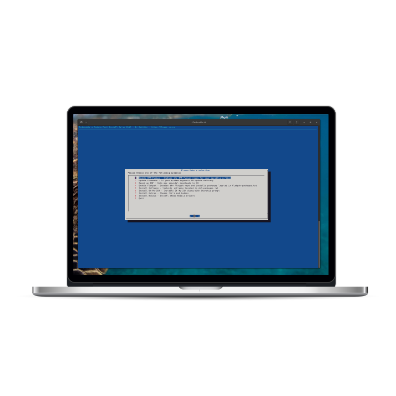

<h1 align="center">
  Fedorable - a Post Install Helper Script
</h1>

  

## What's all this then?

Fedorable is a personal script I created to help with post install tasks such as tweaks and software installs. It's written in Bash and utilises Dialog for a friendlier menu system.

Dialog must be installed for the menu system to work and as such the script will check to see if Dialog is installed. If not, it will ask you to install it.

## Usage
1. Set the script to be executable `chmod -x fedorable.sh`
2. Run the script `./fedorable.sh`

## Files

- **flatpak-packages.txt** - This file contains a list of all flat packages to install you can customise this with your choice of applications by application-id.
- **dnf-packages.txt** - This file contains a list of all applications that will be installed via the Fedora and RPMFusion repositories.

## Screenshot

# Options

- ## Enable RPM Fusion
  - Enables RPM Fusion repositories using the official method from the RPM Fusion website. - [RPM Fusion](https://rpmfusion.org)
  > RPM Fusion provides software that the Fedora Project or Red Hat doesn't want to ship. That software is provided as precompiled RPMs for all current Fedora versions and current Red Hat Enterprise Linux or clones versions; you can use the RPM Fusion repositories with tools like yum and PackageKit.
- ## Update Firmware
  - **Updates firmware providing you have hardwar that supports it.**
- ## Speed up DNF
  - **Sets max parallel downloads to 10**
  - **Enables DeltaRPMs**
- ## Enable Flatpak and Packages
  ### Adds the flatpak repo, updates and installs the following packages (or what you ahve specified in flatpak-packages.txt)
  - **Signal Desktop** - [A cross platform secure messaging service](https://signal.org/en/download/)
  - **Gradience** - [Change the look and feel of Adwaita](https://github.com/GradienceTeam/Gradience)
- ## Install Software
  ### Installs the following pieces of software (or the applications you specify in dnf-packages.txt)
    - **google-chrome-stable** - [Google Chrome Browser](https://www.google.com/intl/en_uk/chrome/)
    - **neofetch** - [CLI system information tool](http://www.figlet.org/)
    - **btop** - [CLI based system monitor](https://github.com/aristocratos/btop)
    - **discord** - [The popular VoIP, IM and Social platform](https://discord.com)
    - **gnome-extensions-app** - Gnome extension management application
    - **gnome-tweaks** - Gnome shell tweak tool
    - **vlc**  - [A cross platform multimedia player](https://www.videolan.org/)
    - **cmatrix** - [Matrix code in your terminal!](https://github.com/abishekvashok/cmatrix)
    - **p7zip** - [High compression archiving application](https://p7zip.sourceforge.net/)
    - **gimp** - [GNU Image Manipulation Program](https://gimp.org)
    - **flameshot** - [FOSS screenshot software](https://flameshot.org/)
    - **libreoffice** - [Free and popular office suite with high compatibility to MS Office formats](https://www.libreoffice.org/)
- ## Install Oh-My-ZSH with StarShip Prompt
  - **Installs Oh-My-Zsh** - [A ZSH configuration management framework](https://ohmyz.sh/)
  - **Installs the Starship prompt for ZSH** - [A popular cross-shell highly customisable prompt](https://starship.rs/)
  
- ## Install Extras
  ### Installs the following theme
    - **gnome-shell-theme-flat-remix** - [Flat Remix Gnome Theme](https://drasite.com/flat-remix-gnome)
    - **flat-remix-theme** - [Flat Remix GTK Theme](https://drasite.com/flat-remix-gtk)
    - **flat-remix-icon-theme** - [Flate Remix Icon Theme](https://drasite.com/flat-remix)
  ### Along with the following fonts
    - **iosevka-term-fonts** - [Iosevka Font](https://github.com/be5invis/Iosevka)
    - **jetbrains-mono-fonts-all** - [JetBrains Font](https://www.jetbrains.com/lp/mono/)
    - **terminus-fonts** - [Terminus Font](https://terminus-font.sourceforge.net/)
    - **terminus-fonts-console** - [Terminus Font](https://terminus-font.sourceforge.net/)
    - **google-noto-fonts-common** - [Google Noto Sans Font](https://fonts.google.com/noto/specimen/Noto+Sans)
    - **mscore-fonts-all**
    - **fira-code-fonts** - [Google Fira Code Font](https://fonts.google.com/specimen/Fira+Code)
  ### Installs the following extras
    - **Sound and video group**
    - **libdvdcss**
    - **gstreamer plugins**
  ### Install Nvidia
    - **Installs the akmod-nvidia driver from the RPMFusion repo's**
