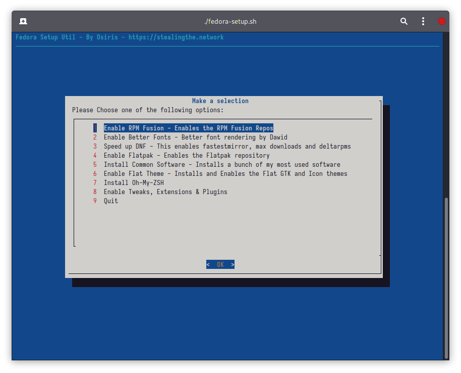

# Fedora-Setup a Post Install Helper Script

## What's all this then?

Fedora-Setup is a personal script I created to help with post install tasks such as tweaks and software installs. It's written in Bash and utilises Dialog for a friendlier menu system.

Dialog must be installed for the menu system to work and as such the script will check to see if Dialog is installed. If not, it will ask you to install it.

## Screenshot

## Options

- **Enable RPM Fusion**
  
  - Enables RPM Fusion repositories using the official method from the RPM Fusion website. 

- **Enable Better Fonts**
  
  - "Provides free substitutions for popular proprietary fonts from Microsoft and Apple operating systems.
    
    It makes your web browsing more aesthetically pleasing - you won't be seeing DejaVu Sans font on every damn webpage." - [GitHub - silenc3r/fedora-better-fonts: Better looking fonts for Fedora](https://github.com/silenc3r/fedora-better-fonts)

- **Speed up DNF**
  
  - Enables FastestMirror, Max Downloads and Deltarpms

- **Enable Flatpak**
  
  - Whilst Flatpak is enabled by default this option enables the repo

- **Install Common Software** - Installs a bunch of my most used software
  
  - gnome-extensions-app 
  
  - gnome-tweaks 
  
  - gnome-shell-extension-appindicator 
  
  - vlc 
  
  - dropbox 
  
  - dnfdragora 
  
  - audacious 
  
  - mscore-fonts-all 
  
  - neofetch 
  
  - cmatrix 
  
  - p7zip 
  
  - unzip 
  
  - gparted

- **Enable Flat Theme**
  
  - Installs and Enables the Flat GTK and Icon themes
    
    - gnome-shell-extension-user-theme 
    
    - paper-icon-theme 
    
    - flat-remix-icon-theme 
    
    - flat-remix-theme

- **Install Oh-My-ZSH**
  
  - Installs Oh-My-ZSH and Powerline Fonts

- **Enable Tweaks, Extensions & Plugins**
  
  - Installs the sound and video group
  
  - gstreamer plugins
  
  - 

## Coming soon

- [ ] Install Microsoft Edge Browser (Stable)

- [ ] Install Microsoft Studio Code
